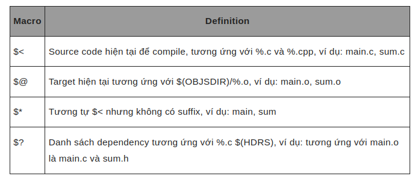
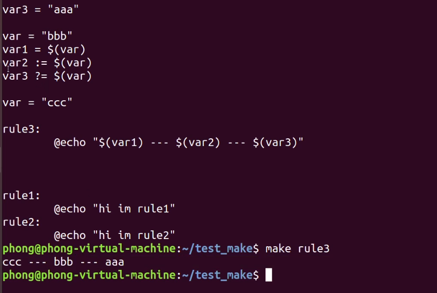

# Make File
## Giới thiệu
Makefile là một công cụ quan trọng trong quá trình xây dựng phần mềm, giúp tổ chức quy trình xây dựng, quản lý các phụ thuộc, và tự động hóa công việc xây dựng, giúp tiết kiệm thời gian và đảm bảo tính nhất quán trong quá trình phát triển phần mềm.<br>
Đối với makefile mỗi lần build lại thì chỉ cần build lại những file thay đổi chính vì vật giúp tiết kiệm thời gian.
Make chứa thông tin và các command cần thực thi, thay vì gõ lệnh dài từng lần để chạy thì mình đặt cho nó cái tên cái rule rồi gọi nó ra để chạy. <br>
## Makefile Syntax
<code>
targets: prerequisites<br>
&emsp;command <br>
&emsp;command <br>
&emsp;command <br>
</code>
targets : filenames cách nhau bởi dấu cách <br>
command : chuỗi các bước thực hiện để tạo ra target(s) <br>
prerequisites : là những file cần thiết trong quá trình command thực hiện<br>
* Lưu ý : trước command là dấu Tab chứ không phải là dấu cách. <br>
Ví dụ : <br>

```
build: main.o
	gcc output/main.o -o output/Results.exe
	./output/Results.exe
main.o: source/main.c
	gcc -c source/main.c -o output/main.o
clean: 
	rm output/*
```

## Biến trong make file 
```
PRO_DIR		:= .
PROJ_NAME	:= PhuongNamCode
OUTPUT_PATH	:= $(PRO_DIR)/output
abc = 123
```
Khai báo biến giống như khai báo trong C, biến này chỉ có thể là dạng strings sử dụng := hoặc = <br>
Để hiển thị gía trị của biến sử dụng: <br>
```
@echo $($(subst print-,,$@))
```
$@ sử dụng để lấy giá trị targetnames <br>
Thay thế  print- bằng giá trị null
## Wildcards
\* và % đều được gọi trong wildcards Make nhưng chúng mang ý nghĩa khác nhau <br>
1. \* <br>
Tìm kiếm filenames phù hợp
```
# in ra thông tin của tất cả .c file
print: $(wildcard *.c)
	ls -la  $?
```  
2. % <br>
Nó có nhiều chức năng ví duj như chức năng ghép nối nhiều chuỗi thành 1 chuỗi hoặc có thể thay thế bằng 1 chuỗi khác. 
```
print-%:
	@echo $($(subst print-,,$@))
```
## Câu lệnh trong make file
Từ khóa Phony để phân biệt hành động và tên file thường đứng trước hành động ( ví dụ hành động clean thì đứng trước hành động này là 
.PHONY clean)<br>
Thêm @ vào trước lệnh thì sẽ không hiển thị thao tác của hành động đó <br>
Phép gán trong Make : <br>
+ "=" gán cố định
+ ":=" tương tự như "="
+ "+=" phép gán nối dài (append), ví dụ khi viết hai dòng
```
 CSRCS+= main.c  
 CSRCS+= sum.c   
 => CSRCS = main.c sum.c   
```
Để lấy giá trị của phép gán ta làm như sau : 
```
${TARGET}   
 hoặc  
 $(CFLAGS) 
 ```
 CFLAGS / LDFLASG
Các flags chứa các options để pass vào cho compiler.
Chú ý -DDEBUG tương ứng với define DEBUG để pass vào source code, ví dụ trong main.c ở trên.<br>
CC / CXX
Compiler để compile, trong vd này sử dụng gcc/g++ để chạy trên máy tính chứ không phải board nhúng, khi cross compiler thì bạn chỉ cần đặt đúng compiler tương ứng với platform cho board là được, ví dụ : 
```
CC=arm-linux-gcc  
CXX=arm-linux-g++  
```
Lệnh shell: Lệnh Shell được đưa vào trong cặp khóa $( ) như dưới đây: <br>
```
OBJS:= $(patsubst %.cpp, $(OBJSDIR)/%.o, $(CPPSRCS))   
mkdir -p $(shell dirname $@)   
 ```

[Link tham khảo](https://eslinuxprogramming.blogspot.com/2015/04/gnu-make.html)

## Thành phần trong MakeFile 
Makefile có chứa 5 thành phần :

    Các Rule rõ ràng, tường mình (explicit rules).
    Cách Rule không rõ ràng (implicit rules).
    Các biến được định nghĩa (variable definition).
    Các chỉ thị (directive).
    Các comment (bắt đầu bằng dấu # )
Implicit Rules

    Compiling a C program: n.o is made automatically from n.c with a command of the form $(CC) -c $(CPPFLAGS) $(CFLAGS) $^ -o $@
    Compiling a C++ program: n.o is made automatically from n.cc or n.cpp with a command of the form $(CXX) -c $(CPPFLAGS) $(CXXFLAGS) $^ -o $@
    Linking a single object file: n is made automatically from n.o by running the command $(CC) $(LDFLAGS) $^ $(LOADLIBES) $(LDLIBS) -o $@
Các biến quan trọng sử dụng trong Implicit Rules : 

    CC: Program for compiling C programs; default cc
    CXX: Program for compiling C++ programs; default g++
    CFLAGS: Extra flags to give to the C compiler
    CXXFLAGS: Extra flags to give to the C++ compiler
    CPPFLAGS: Extra flags to give to the C preprocessor
    LDFLAGS: Extra flags to give to compilers when they are supposed to invoke the linker


Make file cũng có thể include 1 file abc.mk khác 


