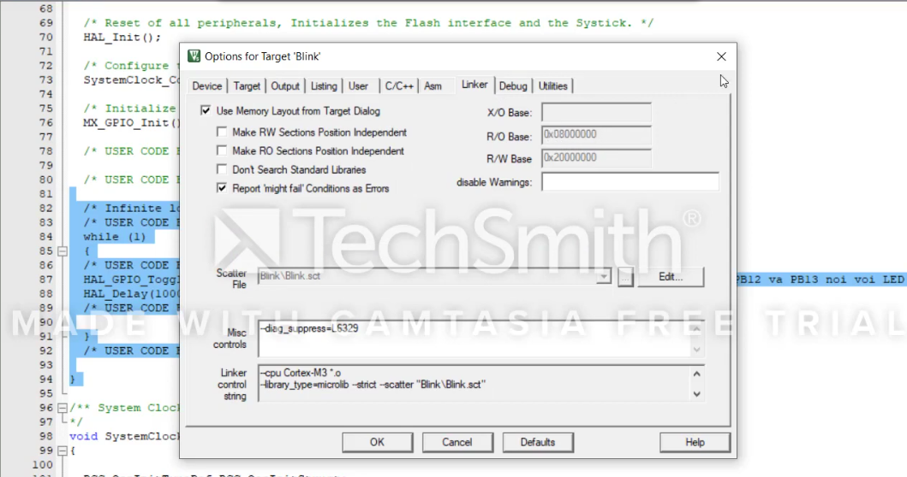
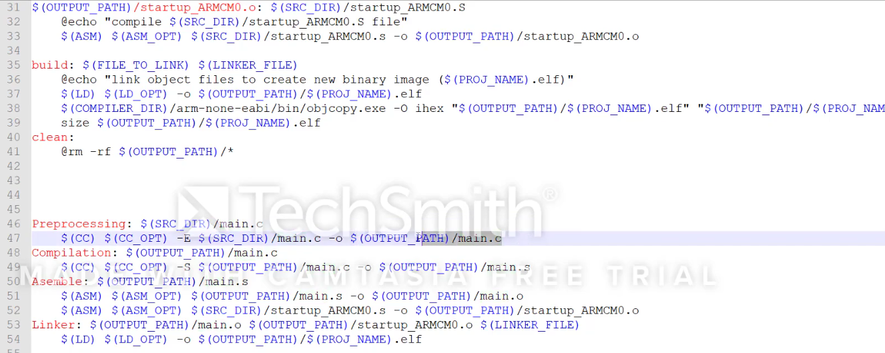
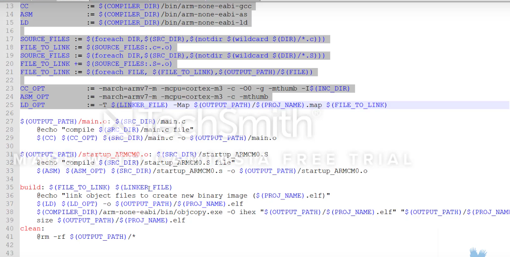
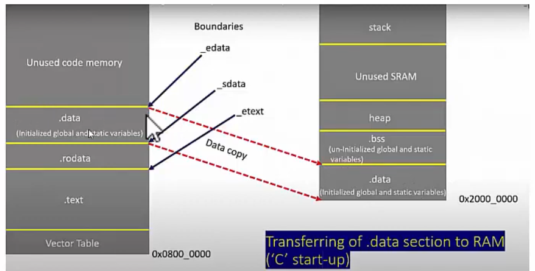
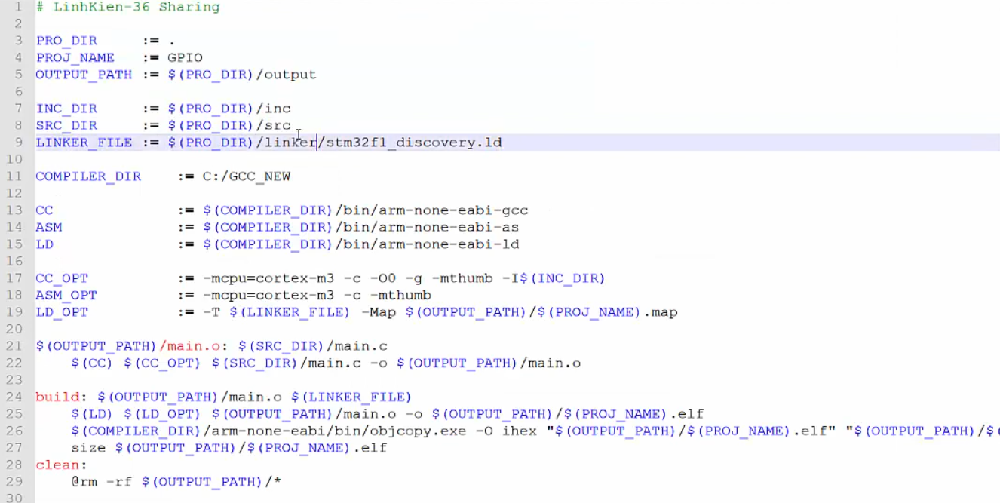
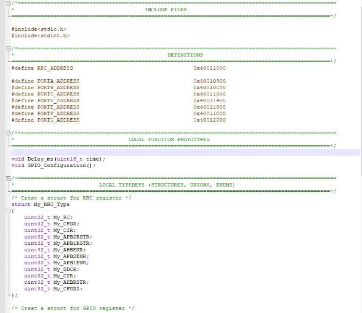
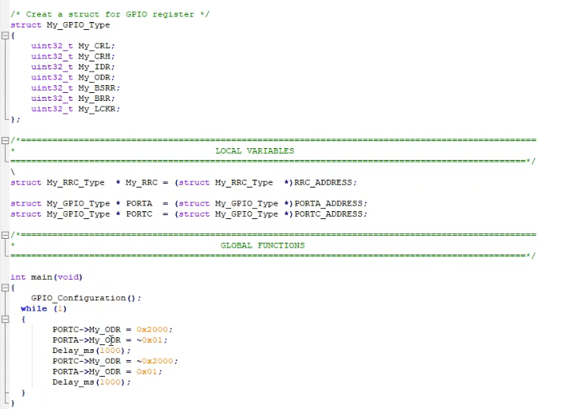
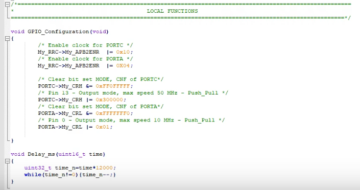
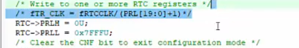

## Booting 
Có nhiều options cho việc này, nạp vào flash thì chương trình sẽ không mất khi tắt nguồn.
Vùng flash xem ở datasheet
Code của mình lưu ở đâu là linker quy định 



Mỗi con chip có vùng nhớ khác nhau nên cần sài linker để phân bổ đúng vùng nhớ. 
Linker scripts thường được sử dụng để chỉ định vị trí và kích thước của các phần quan trọng trong tệp thực thi, chẳng hạn như vùng nhớ chính (RAM), vùng nhớ chỉ đọc (ROM), vùng nhớ dự trữ (BSS), bảng vectơ ngắn nhảy (interrupt vector table), v.v.
```
ENTRY(Reset_Handler)  // Địa chỉ khởi đầu của chương trình

MEMORY
{
  FLASH (rx) : ORIGIN = 0x08000000, LENGTH = 128K  // Vùng nhớ FLASH
  RAM (rwx) : ORIGIN = 0x20000000, LENGTH = 32K    // Vùng nhớ RAM
}

SECTIONS
{
  .text :
  {
    *(.isr_vector)  // Bảng vectơ ngắt
    *(.text)        // Đoạn mã chính
    *(.rodata)     // Những biến không thay đổi được const lưu vào flash
    // * là tất cả những file obj này merge lại với nhau 
  } > FLASH

  .data :
  {
    *(.data)        // Dữ liệu khởi tạo
  } > RAM

  .bss :
  {
    *(.bss)         // Vùng nhớ không khởi tạo
  } > RAM
}
```
Tệp .map là một tệp đầu ra được tạo ra bởi trình liên kết (linker) khi thực hiện quá trình liên kết. Nó chứa thông tin chi tiết về bố cục bộ như vị trí của các biến và hàm trong bộ nhớ, kích thước của các phần khác nhau trong tệp thực thi, và các ký hiệu (symbols) đã được tạo ra

Khi khởi tạo 1 biến nó lưu gái trị vào cả flash và RAM khi tắt nguồn giá trị biến trên RAM mất cần phải copy từ flash vô 




[Logic Analyzer](https://hshop.vn/products/mach-usb-saleae-8ch-24mhz-logic-analyzer) <br>
## RTC
Sử dụng làm 1 đồng hồ chuẩn sử dụng thạch anh nội để làm nên một độ định thời gian chuẩn 

chia cho 32.768 để được tần số là 1HZ